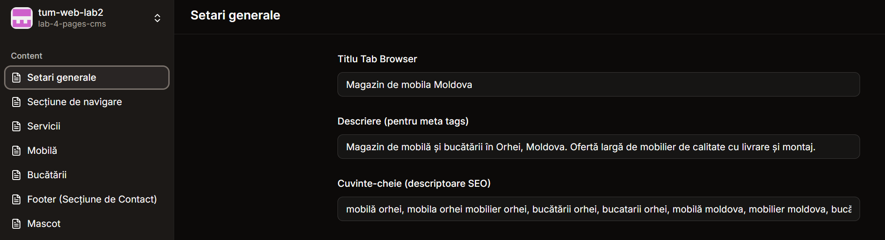
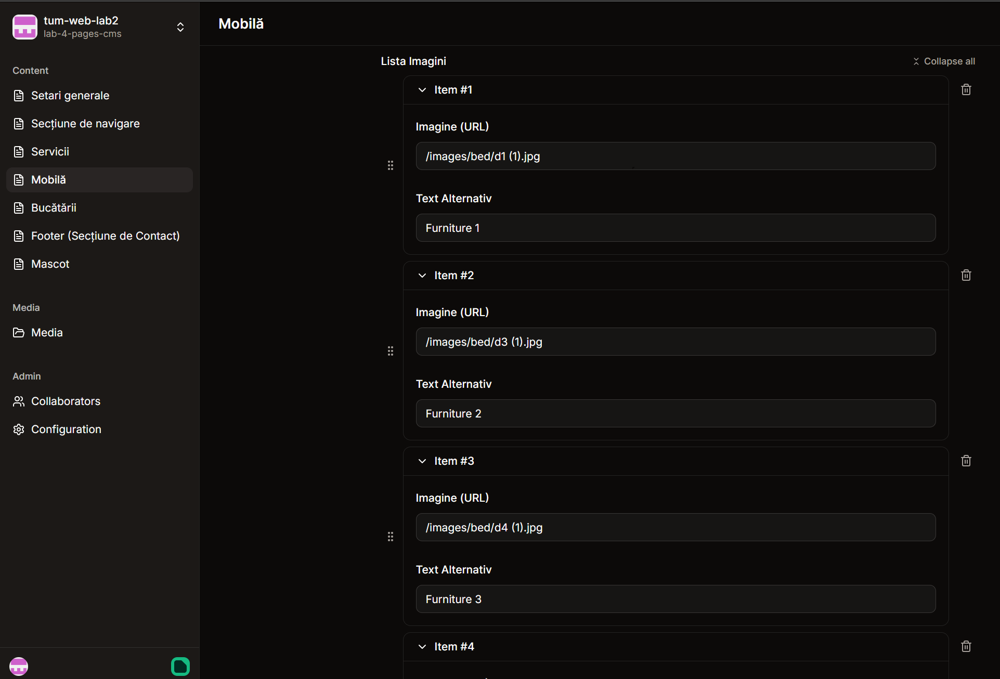
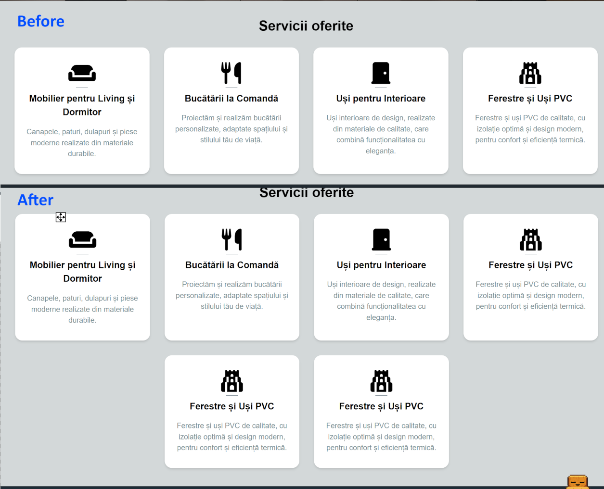
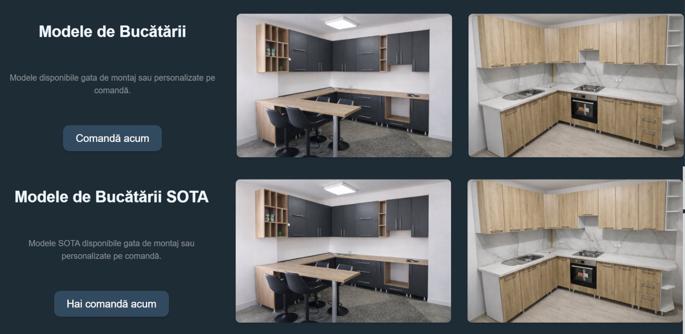

# Lab 4 - Static Site Generator & Git Content Management System

## SSG Migration: HTML → Astro

Migrated the monolithic HTML landing page to **Astro 4.0** static site generator for improved maintainability, component reusability.

### Architecture Changes

**From:** Single `index.html` → **To:** Component-based Astro project

```
astro-project/src/
├── pages/
│   └── index.astro              # Homepage assembling all components
├── components/
│   ├── Header.astro             # Navigation
│   ├── Hero.astro               # Hero section
│   ├── Services.astro           # Sevices section
│   ├── Mascot.astro             # Mascot with speech balloon
│   ├── Kitchens.astro           # Kitchen section
│   ├── Furniture.astro          # Bedroom section
│   └── Footer.astro             # Contact info + address
├── layouts/
│   └── Layout.astro             # Global HTML shell, meta tags, FontAwesome
└── styles/
    ├── global.css               # Tailwind + custom @layer, responsive fonts
    ├── mascot.css               # Mascot animations & speech balloon pseudo-elements
    └── kitchens.css             # Kitchen section grid-area layout
```

### Key Changes

1. **Component Decomposition:** Broke monolithic HTML into 7 reusable `.astro` components
2. **CSS Migration:**
   - Removed all `@apply` directives (Tailwind v4 incompatibility)
   - Converted to explicit CSS properties for `mascot.css` and `kitchens.css`
   - Moved complex grid layouts (`grid-template-areas`) to separate CSS files
3. **Image Paths:** Updated all image references to use root-relative URLs (`/images/...`)
4. **Build System:** Integrated `@astrojs/tailwind` for zero-config Tailwind support
5. **Global Configurations:** Moved from `tailwind.config.js` to `global.css`

## Git CMS Integration - PagesCMS Implementation

### What Was Done ✅

**All major content sections** now pull data from editable JSON files stored in `src/data/`:

| Section   | Editable Fields                                     | Type          |
| --------- | --------------------------------------------------- | ------------- |
| Config    | Title, description, keywords                        | Fixed         |
| Header    | Company name                                        | Fixed         |
| Hero      | Desktop/mobile text, CTA button, background image   | Fixed         |
| Services  | Heading + items (title, description, icon)          | Dynamic array |
| Furniture | Heading + images, button texts                      | Dynamic array |
| Kitchens  | Heading, description, 5 image URLs + alt text       | Fixed count   |
| Footer    | Contact sections (heading + description), Maps link | Dynamic array |
| Mascot    | Question text + button text                         | Fixed         |

**CMS Configuration** - `.pages.yml` defines all editable fields for PagesCMS:

- Uses `type: object` + `list: true` for repeatable items
- Users can add/remove items from array sections via CMS UI
- Auto-commit changes to GitHub, auto-triggers site rebuild

### What You Cannot Do Yet ❌

- **Add new sections** from CMS (e.g., "Testimonials") - requires code/git access
- **Edit CSS/Colors** - styling is hardcoded in Tailwind utilities and component stylesheets

### Design Decisions

**JSON-only architecture** vs. Content Collections - Reduces complexity, minimal overhead, direct component imports

**Dynamic vs. Static Arrays:**

- **Kitchen images:** 5 fixed (specific layout positioning required)
- **Services, Furniture, Footer:** Dynamic count (users can add/remove)

**Field Types:**

- `string` - Single-line text (headings, labels)
- `text` - Multi-line text (descriptions)
- `object` + `list: true` - Repeatable fields

**Showcase Images:**

- PagesCMS UI setari generale
  
- PagesCMS UI array de furniture
  
- Services: Before/after adding 2 new
  
- Furniture: modificari in text
  

---

## Project Links

- GitHub Pages: https://arturtugui.github.io/tum-web-lab2/
- Live Site (GitHub Pages): https://www.mobila-orhei.tech/
